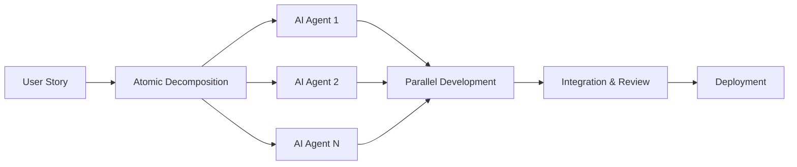

  <h1>🤖 AI-Powered Software Engineer</h1>
  <h3>Leveraging AI Agents for Parallel Feature Development</h3>
  
  

---

## 🚀 About Me
I'm a software engineer who **leverages AI to the hilt** by using AI agents to develop features in parallel. My approach: break user stories into small atomic pieces and deploy AI agents to work on them simultaneously, dramatically accelerating development velocity.

**My AI-Powered Development Philosophy:**
- 🤖 **AI Agent Orchestration**: Deploy multiple AI agents to work on different features simultaneously
- ⚛️ **Atomic Feature Decomposition**: Break complex user stories into the smallest possible, independent pieces
- 🚀 **Parallel Development**: Maximize throughput by running development streams in parallel
- 🔄 **Continuous Integration**: Seamlessly merge AI-generated code with human oversight

**Current Focus:**
- 🌱 Perfecting AI agent workflows for maximum development efficiency  
- 💞️ Building tools that enhance AI-human collaboration in software development
- 🎯 Exploring the cutting edge of AI-assisted programming

## 🛠️ Tech Stack & AI Arsenal

### 🤖 AI Development Tools

### 💻 Core Technologies

### 🎨 Frontend & UI

### ⚡ Backend & Infrastructure

### ☁️ Cloud & DevOps

## 📈 My AI-Driven Development Methodology

**The Process:**
1. **🎯 Story Analysis**: Break down complex features into atomic, independent pieces
2. **🤖 Agent Deployment**: Assign specialized AI agents to different components
3. **⚡ Parallel Execution**: Run multiple development streams simultaneously
4. **🔗 Smart Integration**: Merge AI-generated code with human oversight
5. **🚀 Rapid Iteration**: Deploy faster than traditional sequential development

## 🔄 Recent Activity

> Last updated: 2025-07-02 06:07 UTC

- 🔨 **joemocha/joemocha**: Update AI development tools to reflect actual toolkit

- Replace ChatGPT with Augment Code (purple badge)
- Replace Cursor with Windsurf (blue badge)
- Keep Claude and GitHub Copilot badges

## 📫 Let's Connect & Collaborate

  

---

  <i>🤖 Building the future with AI agents, one atomic feature at a time</i> 
  ⭐️ From [joemocha](https://github.com/joemocha)

